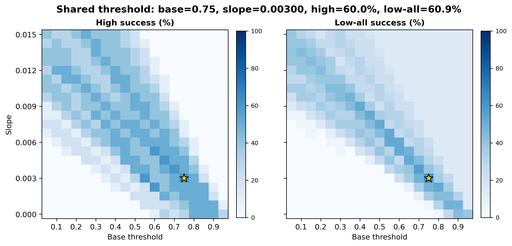
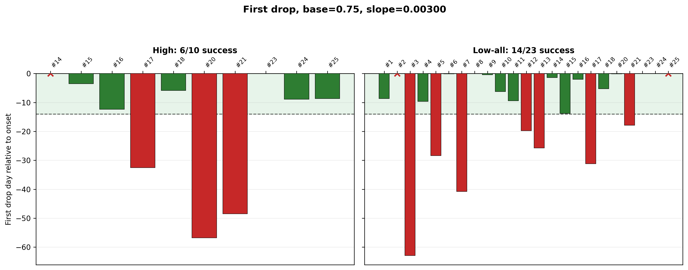
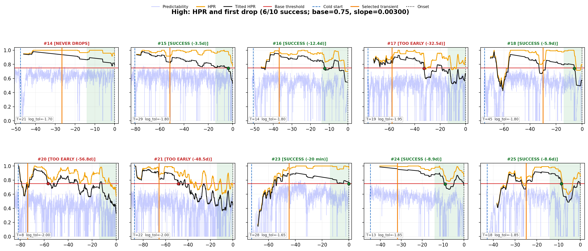

# dip-analysis — Step 1: 파라미터 탐색

고해상도(high)·저해상도(low_all) 두 체온 측정 그룹 모두에서 잘 맞는 predictability 판정
파라미터를 찾는다. 480개 조합(판정규칙 x T_MAX x window_days x alpha)을 다 계산해서 성적을 매기고,
24가지 평가 기준으로 반복 검증해도 안정적으로 뽑히는 후보를 최종 확정한다.

## 폴더 구조

```
dip-analysis/
├── lib/                    핵심 계산 함수 (라이브러리, 직접 실행 안 함)
│   ├── tconfig.py           rel_err -> predictability 변환
│   ├── transient.py         transient 판정
│   └── search_and_selection.py   파라미터 탐색 전체 로직
├── scripts/
│   └── 01_run_sweep.py     실행 스크립트 (이 파일을 돌림)
├── data/
│   ├── raw_temperature/    원본 체온 (high/low 각 1개 CSV, hamster 전체 포함)
│   ├── high/{h14,...}/     고해상도 hamster별 relative_error + window_times (12마리 전체)
│   ├── low/{h1,...}/       저해상도 hamster별 relative_error + window_times (25마리 전체)
│   └── metadata/           hamster별 cold_start, onset_time
└── output/
    ├── param_sweep/        이번 실행 결과 (아래 설명)
    └── predictability_cache/  뽑힌 후보들의 predictability 원자료 (dip 단계에서 재사용)
```

데이터는 개체를 미리 빼지 않고 전체를 다 담아뒀다. 어떤 개체를 뺄지는 실행할 때 명령행에서 정한다.

## 실행 방법 (서버 기준)

```bash
cd dip-analysis

# 1) 환경 준비 — pandas, numpy, scipy, matplotlib이 있는 conda/micromamba 환경 필요
micromamba create -n h14viz python=3.11 numpy pandas scipy matplotlib -y
# (이미 h14viz 환경이 있는 서버라면 이 단계는 생략)

# 2) 실행 — 공식 결과를 재현하려면 high/low 둘 다 #19, #22 제외 필수
LOW_EXCLUDE_IDS='#19,#22' HIGH_EXCLUDE_IDS='#19,#22' micromamba run -n h14viz python3 scripts/01_run_sweep.py
```

- 소요 시간: 약 3.5분 (hamster 33마리 x 480개 조합 + 최종 후보 상세 시각화)
- 경로는 전부 스크립트 파일 위치 기준 상대경로라서, 저장소 폴더를 통째로 어느 서버로 옮겨도
  위 명령어 그대로 실행된다. 코드 수정 불필요.
- `LOW_EXCLUDE_IDS`, `HIGH_EXCLUDE_IDS`를 비우거나 다른 값을 주면 다른 개체 구성으로 다시 돌려볼 수 있다.
- 결과 폴더 이름을 바꾸고 싶으면 `SWEEP_OUT=다른이름`을 앞에 붙이면 된다.

## 핵심 결과

**최종 채택 파라미터**: `continuation_3` 규칙, T_MAX=45, base_threshold=0.75, slope=0.003
— 고해상도 성공률 60.0%(6/10), 저해상도 성공률 60.9%(14/23)
(24가지 평가 기준 중 10/24에서 1위로 선택됨, 가장 안정적인 후보)



왼쪽이 고해상도, 오른쪽이 저해상도 성공률 히트맵(가로=base_threshold, 세로=slope, 색이 진할수록 성공률↑).
노란 별표가 채택된 지점이다.

**첫 체온하강일(first drop)**: 초록=성공, 빨강=실패.



**HPR 상세 곡선** (hamster별 predictability/HPR/tilted HPR, 고해상도 예시):



이 외에 `final_candidate_transient_bars.png`(추위시작→transient→onset 막대그래프),
`final_candidate_bodytemp_high.png` / `final_candidate_bodytemp_low_all.png`(원본 체온 격자),
`final_candidate_hpr_low_all.png`(저해상도 HPR 격자)도 같은 폴더에 있다.

## output 안의 파일들

스크립트가 실행되는 순서대로 만들어진다. 총 19개.

### 1. 480개 조합 전체 채점

- `global_good_area_all_combinations.csv` — 한 줄이 조합 하나, 480줄. 각 조합에서의 high/low 성공률, 격차, 좋은 영역 개수.

### 2. 24가지 기준 순서로 후보 뽑기

- `criterion_order_sensitivity_all_24_permutations.csv` — 4개 지표(합·격차·좋은영역·fallback)의 우선순위를 24가지로 바꿔가며 각각 1등을 뽑은 기록. 24줄.
- `criterion_order_sensitivity_selected_summary.csv` — 위 24줄을 같은 조합끼리 묶어서, 몇 번 1등했는지(`n_orders_selected`)를 센 표. 맨 윗줄이 최종 채택 조합이다.

### 3. 최종 채택 조합 하나의 상세

이 조합에 대해 base_threshold(19개) x slope(21개) = 399칸을 계산하고, 같은 결과를 4단계로 압축해서 저장한다.

1. **399칸 원자료 4개** — 전부 같은 모양(행=slope, 열=base_threshold)이고 값만 다르다.
   - `final_candidate_high_success_matrix.csv` — 고해상도 성공률(%)
   - `final_candidate_low_all_success_matrix.csv` — 저해상도 성공률(%)
   - `final_candidate_combined_success_matrix.csv` — 위 둘을 더한 값 (최대 200)
   - `final_candidate_min_success_matrix.csv` — 위 둘 중 낮은 쪽. 한쪽만 잘 되는 칸을 걸러낸다.
2. **`final_candidate_top80_base_slope.csv`** — 399칸을 성적순으로 정렬해 상위 80개만 남긴 순위표. 1등 줄이 채택 지점.
3. **`final_candidate_summary.csv`** — 그 1등 지점 하나의 요약 1줄. 입력 파라미터, 성공률, 격차, 좋은 영역 개수, fallback 비율.
4. **`figures/final_candidate_high_lowall_two_panel_heatmaps.png`** — 1번의 high/low 두 표를 색으로 그린 그림. 노란 별표가 2번의 1등 지점.

즉 **수치(399칸) → 순위표(80개) → 요약(1줄) → 그림** 순으로 같은 결과를 점점 압축한 것이다.

여기에 hamster별 판정 결과가 더해진다.

- `final_candidate_first_drop_days.csv` — hamster별 first-drop 날짜와 성공 여부.
- `figures/final_candidate_first_drop.png` — 위 표를 막대그래프로.
- `figures/final_candidate_transient_bars.png` — hamster별 추위시작 → transient → onset 기간.
- `figures/final_candidate_hpr_high.png`, `final_candidate_hpr_low_all.png` — hamster별 predictability/HPR/tilted HPR 곡선.
- `figures/final_candidate_bodytemp_high.png`, `final_candidate_bodytemp_low_all.png` — hamster별 원본 체온 곡선.

### 4. predictability 저장

- `predictability_cache/predictability_selected_candidates.csv` — 2단계에서 뽑힌 후보들의 predictability 값(hamster x 시각). 이후 dip 단계는 이 파일만 읽으면 되고 predictability를 다시 계산하지 않는다.

### 5. 실행 조건 기록

- `run_config.txt` — 제외한 개체, 조합 수, 소요 시간.
